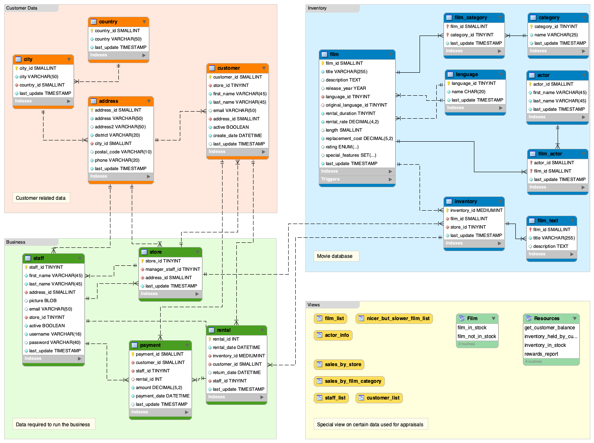

# An introduction to NodeJS - Express and ORM 

Hi folks,
This repo will contains the stuff done on this kind session.
It'll be split in those sections :

1. Whats Node
2. ExpressJS
3. Routes & templates: twig usage to generate html for us, routes sample.
4. Prisma: this part will only place a select aggregate on a DB with sample data

## Sample data
We'll use the sample data povided by MySQL Workbench to avoid wasting time to create ones.

## Supports
* Presentation: https://prezi.com/view/rdGEeQXKoiYQHyBZlxU7/
* Node doc: https://nodejs.org/api/n-api.html  
* Prisma ORM: https://www.prisma.io/orm 

## Contact
Feel free to contact me if needed via [LinkedIn](https://www.linkedin.com/in/bertrand-michaux-477619153/).
